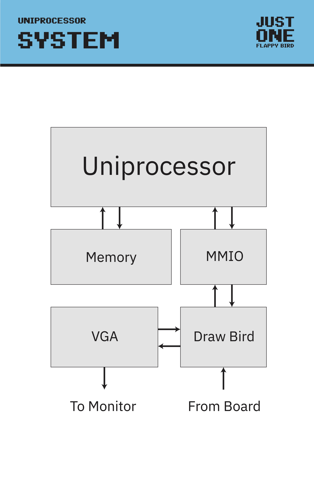

  

# JustOneFlappyBird

JustOneFlappyBird is a turing complete, single instruction set processor that can execute the programming langugae SUBLEQ, which stands for "SUBtract and branch if Less-than or EQual to zero". As a demonstration of its functionality, we animated Flappy Bird on a VGA display. 

This project was part of **[Build18](https://www.build18.org/) 2025 at CMU**, a week-long hardware hackathon. Our team members were (in alphabetical order) David Chan, Kody Liang, Jaehyun Lim, and John Alacce. 

We used a Xilinx Spartan 7 FPGA to synthesize our processor on. We used SystemVerilog for the RTL, VCS for verification, and Vivado for synthesis.

### A brief guide to SUBLEQ
SUBLEQ instructions are of the form, `A B C` where A, B, and C are all memory addresses. The processor computes the value of *B - \*A (\* meaning dereference) and stores it back into B. If the result was less than or equal to 0, PC jumps to C. A, B, and C are each 32 bits and must be read out of memory one at a time. That's it! 

## Processor Architecture
Our processor consists of a PC register, two "general purpose" registers for collecting the value of operand A and operand B, and a register for saving the value of the memory address B for storing the result of the subtraction later. We use a dual ported memory to read A and B simultaneously. Execution of a single instruction is completed in 8 cycles detailed in the FSM section below.

  <kbd>
    
  </kbd>

## Processor Logic FSM
Our processor completes an instruction in 8 cycles. To summarize the diagram below, first we get A and B out of memory with the PC and PC+1. We save B into a register and read from memory again, this time with A and B. We save those read values into our other two registers and read C at the same time. Then, we save the subtracted result into B and jump to C if B-A<=0.

  <kbd>
    
  </kbd>

## System Architecture
Our system architecture consists of the processor and the memory communicating between each other, and an MMIO interface to communicate with external modules "Draw Bird" and VGA. When the processor writes a value to MMIO, Draw Bird picks it up to update the bird's position on the screen and draw it on the VGA display. 

  <kbd>
    
  </kbd>

## How to draw Flappy Bird in VGA

  <kbd>
    
  </kbd>

## Photos!
